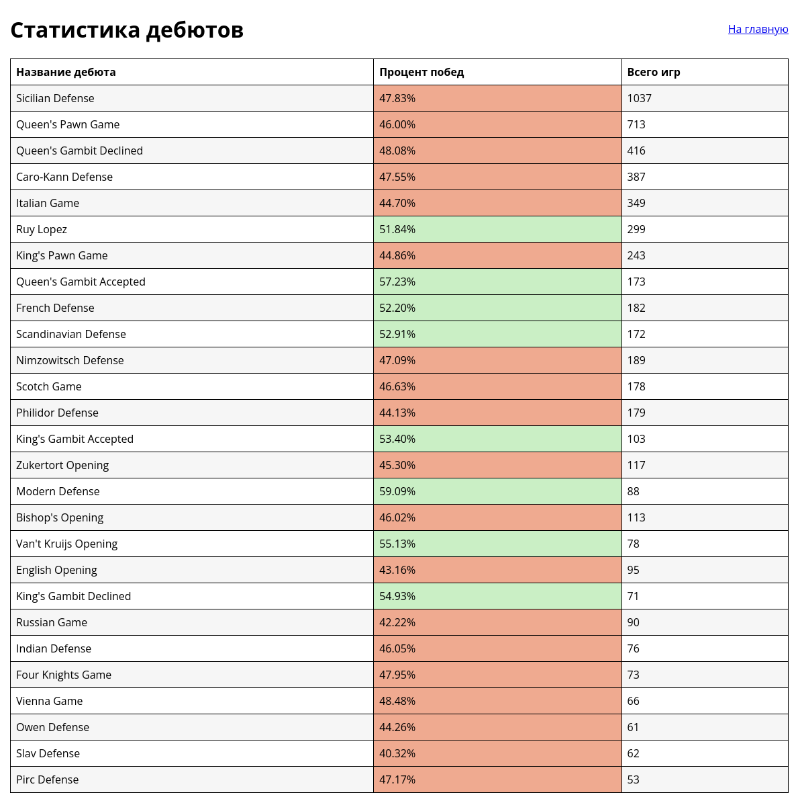

# Listat
Приложение для отображения статистики дебютов в рейтинговых играх на lichess.org.

## Установка

Для скачивания игр необходим создать токен: https://lichess.org/account/oauth/token/create

```
source env/bin/activate
pip install -r requirements.txt
flask --app leh init-db
flask --app leh --debug run
```

Перейти по адресу http://127.0.0.1:5000/ и ввести токен в форму.


